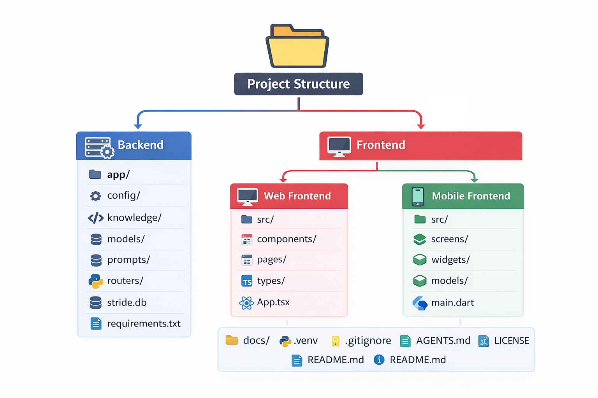
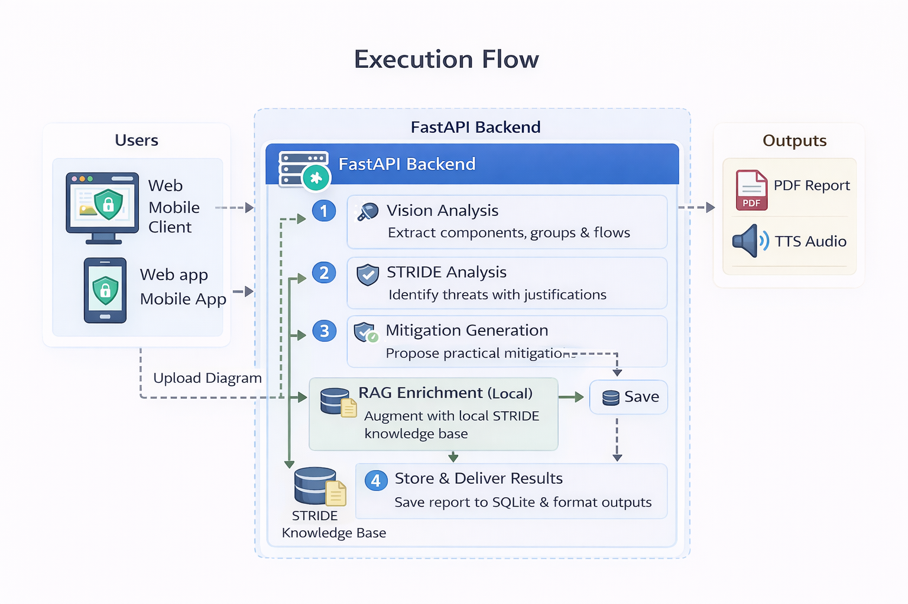

# FIAP Software Security - STRIDE Modelador de Ameaças (LLM-first)

MVP para modelagem automatizada de ameaças STRIDE a partir de diagramas de arquitetura.

## O que é STRIDE
STRIDE é um modelo de ameaças da Microsoft usado para identificar riscos de segurança em arquiteturas de software.
Ele organiza riscos em seis categorias:
- `S` Spoofing (falsificação de identidade)
- `T` Tampering (violação de integridade)
- `R` Repudiation (repúdio)
- `I` Information Disclosure (divulgação de informação)
- `D` Denial of Service (negação de serviço)
- `E` Elevation of Privilege (elevação de privilégio)

## Artefatos visuais (docs)
Clique nas miniaturas para abrir a imagem completa:

<p align="center">
   <a href="docs/dir.png">
    
  </a>
    <a href="docs/wf.png">
    
  </a>
</p>

## Visão geral
- Entrada: imagem de diagrama (`PNG`, `JPG`, `JPEG`, `GIF`, `WEBP`, `BMP`).
- Estágio 1 (Vision): GPT-4o extrai `context_summary`, componentes, grupos e fluxos em JSON.
- Estágio 2 (STRIDE): GPT-4o + RAG local + regras determinísticas gera ameaças e mitigações.
- Voz (TTS): backend sintetiza narração em pt-BR e web/mobile pré-carregam 3 áudios ao abrir o resultado.
- Saída: resposta JSON, persistência em SQLite e relatório PDF.
- Idioma: resultados para o usuário final em português (pt-BR).
- Evolução em andamento: adoção gradual de LangChain para orquestração, RAG e observabilidade.

## Apresentação
- Slides e roteiro: [`docs/APRESENTACAO.md`](docs/APRESENTACAO.md)

## Stack
- Backend: FastAPI + SQLAlchemy async + SQLite
- Web: React + TypeScript + Vite
- Mobile: React Native + Expo
- IA: OpenAI GPT-4o (vision + texto)
- Dependencias Python: `requirements.txt` (na raiz, usado pelo backend)
- Dependencias JS: `frontend/web/package.json` e `frontend/mobile/package.json`

## Estrutura
- `backend/`: API, modelos, serviços e prompts
- `frontend/web/`: interface web
- `frontend/mobile/`: app mobile
- `docs/GUIA.md`: guia operacional único
- `teste/`: imagens de validação, script de teste e relatórios

## Preparar ambiente (Python + .env)
O arquivo `requirements.txt` deste projeto fica na raiz e concentra as dependencias Python do backend.

```bash
cd backend
# criar ambiente virtual local
python -m venv .venv

# ativar ambiente virtual (uso automático no terminal atual)
# Linux/macOS:
source .venv/bin/activate
# Windows (PowerShell):
.venv\Scripts\Activate.ps1

# instalar dependências Python
python -m pip install --upgrade pip
# este requirements e apenas do backend
pip install -r ../requirements.txt

# copiar arquivo de exemplo e ajustar OPENAI_API_KEY
# Linux/macOS:
cp .env.example .env
# Windows (PowerShell):
Copy-Item .env.example .env
```

## Executar localmente

Você pode iniciar o projeto de duas formas:
- Script automatizado:
  - Windows: `run.bat`
  - macOS/Linux: `runmac.sh`
- Execução manual por componente (backend, web e mobile), conforme seções abaixo.

Com os scripts (`run.bat` ou `runmac.sh`) você pode:
1. Subir web
2. Subir mobile com QR Code (mesma rede local)
4. Executar teste automático

No app mobile, além de selecionar imagem da galeria, o usuário também pode tirar foto para enviar o diagrama.
O usuário não grava áudio: a voz é gerada automaticamente pelo sistema para ler contexto, criticidade e mitigações.

### Uso dos scripts
Windows:
```bat
run.bat
```

macOS/Linux:
```bash
chmod +x runmac.sh
./runmac.sh
```

### 1) Backend
```bash
cd backend
# iniciar API
python -m uvicorn app.main:app --reload --host 0.0.0.0 --port 8000
```
Swagger: `http://localhost:8000/api/docs`

### 2) Frontend web
```bash
cd frontend/web
npm install
npm run dev
```
App web: `http://localhost:5173`

### 3) Mobile (opcional)
```bash
cd frontend/mobile
npm install
npx expo start
```
Observação para celular físico: o telefone deve estar na mesma rede Wi-Fi do computador.

### 4) Menu rápido no Windows
```bat
run.bat
```
Opções do menu:
1. Subir web (sempre sobe backend antes)
2. Subir mobile com QR Code (rede local, sempre sobe backend antes)
4. Executar teste automático da pasta `teste` (sempre sobe backend antes)

## API principal
- `POST /api/analysis`: upload e análise completa
- `GET /api/analysis`: lista processamentos salvos
- `GET /api/analysis/{id}`: detalhes do processamento salvo
- `GET /api/analysis/{id}/image`: imagem original enviada
- `GET /api/analysis/{id}/pdf`: download do relatório
- `POST /api/audio/speech`: sintetiza texto em áudio (mp3 base64) para leitura da análise em pt-BR
- `POST /api/audio/transcribe`: endpoint backend de transcrição (não exposto na UI do usuário final)
- `GET /api/health`: health check

## Rastreabilidade STRIDE (RAG)
Cada item em `threats[]` inclui:
- `evidence`: evidências observadas no diagrama/fluxos/fronteiras.
- `reference_ids`: ids das referências de segurança usadas na decisão (ex.: `STRIDE-001`).

Base local de conhecimento: `backend/app/knowledge/stride_rag.md`.

## Roadmap LangChain
Fase 1 (documentação e desenho):
1. Definir arquitetura alvo com chains separadas para Vision e STRIDE.
2. Definir contratos de entrada/saída e estratégia de parser estruturado.
3. Definir estratégia de RAG (chunking, retrieval e citação de fontes).

Fase 2 (implementação backend):
1. Introduzir camada `app/services/langchain/` com chain de Vision.
2. Introduzir chain STRIDE com contexto RAG e validação de schema.
3. Manter endpoints atuais sem quebra de contrato.

Fase 3 (qualidade e operação):
1. Instrumentar rastreabilidade de execução (traces por análise).
2. Comparar qualidade entre pipeline atual e pipeline LangChain.
3. Consolidar pipeline único e remover duplicação.

## Exibição de resultado
- Web e mobile permitem processar nova imagem ou abrir processamento salvo.
- A tela de resultado exibe, nesta ordem:
  1. imagem submetida,
  2. `context_summary`,
  3. resumo e listagens STRIDE.
- Ao concluir ou reabrir uma análise, web e mobile enviam 3 textos para TTS e deixam o áudio pré-carregado:
  1. contexto da infraestrutura + criticidade geral,
  2. ameaças e mitigações,
  3. recomendações.
- O usuário aciona a reprodução pelos ícones de áudio em cada seção.
- Nota de custo: para economizar chamadas TTS, desabilite `PRELOAD_TTS_ON_RESULT` em `frontend/web/src/App.tsx` e `frontend/mobile/App.tsx`.
- O PDF também inclui imagem submetida, contexto e listagens STRIDE.

## Documentação
- `AGENTS.md`: protocolo operacional de execução.
- `docs/GUIA.md`: arquitetura, operação e checklist de validação.

